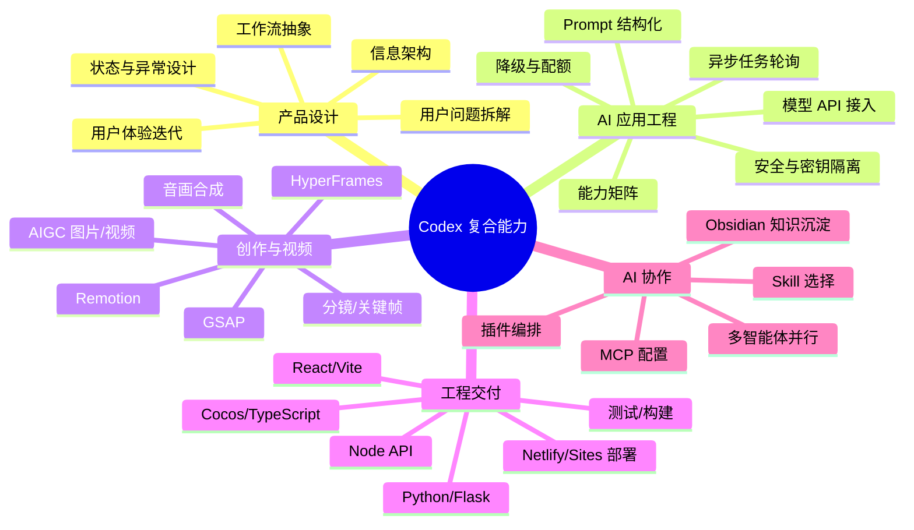

# Codex 操作与能力地图

> 这份文档总结截至 2026-08-03 在 Codex 中已经实际使用过的项目、Skill、插件、提示词方法、MCP/外部连接和多智能体协作。区分“已实际使用”和“安装/了解”，不把尝试性配置包装成生产经验。

## 一句话能力画像

能够使用 Codex 将一个模糊想法推进为可运行、可测试、可部署、可展示的 AI 产品或内容项目；覆盖需求分析、架构拆解、前端/后端实现、模型 API 接入、工作流编排、视觉设计、视频制作、故障诊断、质量验证、文档沉淀和多智能体协作。

## 能力总图

## 一、实际完成过的主要项目能力

### 1. AI 视频/图片生成工作台

- 抽象 9 类视频工作流和 2 类图片工作流。
- 建立模型能力矩阵，根据素材类型、数量、时长、清晰度、比例和音频能力动态生成表单。
- 统一接入阿里云百炼 Wan、Agnes、Sub2API Grok，处理任务创建、状态轮询、结果解析和错误处理。
- 使用 reducer、任务 token 和轮询重试解决异步状态覆盖、旧任务回写和网络抖动。
- 完成服务端密钥隔离、访问令牌、限流、下载域名校验、素材大小限制和过期清理。
- 兼容 Netlify Functions、Cloudflare Worker/R2、Netlify Blobs 和 Sites Worker 部署形态。
- 使用真实产品截图制作 72 秒导览视频和 32 秒产品短片，项目测试累计 36 项通过。

**体现能力**：AI 产品抽象、API 适配、全栈实现、异步系统、服务安全、部署和产品演示。

### 2. 花店订单物语 Cocos 游戏

- 使用 Cocos Creator 3.8.8、TypeScript 和 Web Mobile 完成竖屏合成游戏。
- 实现花材发射、重力下落、碰撞合成、危险线、订单目标、得分、胜负结算和本地存档。
- 将简单合成循环升级为花店委托、连携奖励、花语印记和催花机制。
- 使用 Service 层管理关卡状态、localStorage 存档和跨场景音频。
- 诊断并修复空场景黑屏、控制器未挂载、素材占位、启动脚本编码和端口冲突问题。
- 完成 8 个关卡、Web Mobile 构建、390×844 竖屏回归和 Netlify 发布。
- 使用 Remotion 制作 20 秒竖屏产品展示视频。

**体现能力**：游戏产品设计、状态管理、TypeScript 工程、Windows 启动诊断、移动端验收和发布。

### 3. 飞书一键生成小说与配图工作流

- 从零设计多维表字段、小说项目/章节任务/角色视觉设定三张表和两条自动化流程。
- 编排大纲、角色、章节正文、配图提示词、图片生成、质检、状态回写和成稿合并。
- 编写可复制提示词、工作流 JSON 蓝图、Node 运行服务、Webhook 和环境变量模板。
- 设计 HTTP 接口、轮询、超时、重复触发保护、请求体限制、原子写入和错误状态。
- 通过多智能体并行完成代码审查、飞书接入检查和文档/端到端验证，再由主 agent 统一合并。
- 完成创建项目 → 生成大纲 → 生成章节 → 生成插图 → 输出 Markdown 成稿的本地测试链路。

**体现能力**：工作流产品设计、内容自动化、外部系统接入、Webhook/API、质量门槛和多智能体协作。

### 4. 冰箱食材搭配助手

- 以“冰箱食材 → 可做菜 → 补料/采购 → 入库 → 烹饪”为核心闭环设计单文件本地优先产品。
- 实现别名归一化、菜谱匹配、差 1 样分组、按人数配菜、采购清单、收藏、菜谱 CRUD、备份恢复和分步烹饪。
- 根据用户视角完成 8 轮、S1-S49 体验迭代，处理移动端遮挡、流程断点、新手引导和无障碍问题。
- 通过 Node 自测脚本完成 128/128 回归验证。

**体现能力**：用户需求抽象、产品闭环、原生前端、localStorage、持续 UX 迭代和测试意识。

### 5. 简历优化助手

- 设计 AI 对话、简历/职位分析、会话管理和 Markdown 导出的产品流程。
- 实现流式对话、消息复制/删除/重新生成、会话新建/重命名/搜索/删除、登录状态感知和快捷提问。
- 通过前后端清空接口解决本地清空后被后端重新加载的问题。
- 增加失败状态、重试入口、错误态视觉和二次确认，形成可恢复的对话体验。
- 完成客户端/服务端 TypeScript 检查和 Vite 生产构建。

**体现能力**：AI 对话产品、流式状态、前后端一致性、错误恢复、可追溯交互和组件化前端。

### 6. AIGC 动画与产品演示视频

- 根据 PDF 需求拆解剧情、时长、画幅和交付规格，设计分镜和视觉规范。
- 使用 Imagegen 生成关键帧，Agnes 图生视频生成动态片段，HyperFrames/GSAP/Remotion 编排镜头、字幕、音效和转场。
- 使用 FFmpeg 处理兜底渲染、音画合成和编码检查；用浏览器截图和视频抽帧做质量验收。
- 处理公网素材 URL、API 限流、内容过滤、角色漂移、渲染链失败和视频编码问题。

**体现能力**：AIGC 内容生产、视频工作流、分镜、关键帧、音画后期、质量控制和问题复盘。

## 二、Skill 使用地图

### 已实际使用并形成产出的 Skill

| Skill | 实际用途 |
|---|---|
| `zoom-out` | 从单个文件/报错上升到项目架构、产品链路和面试叙事 |
| `diagnose` | 按复现→最小化→假设→证据→修复→回归处理黑屏、端口、编码、API和部署问题 |
| `frontend-design` | 设计产品视觉方向、信息层级、响应式布局和真实内容约束 |
| `design-taste-frontend` | 降低模板化 AI 风格，优化作品集和产品界面的视觉识别度 |
| `sites:sites-building` | 将 LifeMonster 等项目做成可运行的网站和产品展示站 |
| `sites:sites-hosting` | 管理 Sites 版本、访问策略、发布和部署状态 |
| `netlify-deploy` | 构建、绑定、发布 Netlify 站点及 Functions/环境变量 |
| `browser:control-in-app-browser` | 操作页面、点击流程、截图、检查控制台和移动端布局 |
| `computer-use` | 控制 Windows 应用、Cocos/浏览器和本地工具完成真实回归 |
| `pdf:pdf` | 读取测试题 PDF、提取剧情和交付规格 |
| `imagegen` | 生成动画关键帧和缺失的视觉素材 |
| `hyperframes` 系列 | HTML 视频结构、时间线、音频、字幕、转场和可渲染组合 |
| `hyperframes-animation` / `GSAP` | 编排逐元素入场、镜头运动、节点脉冲和转场动效 |
| `hyperframes-cli` | 检查、预览、捕获、渲染和诊断 HyperFrames 项目 |
| `remotion` 系列 | 使用真实产品/游戏截图制作 20–32 秒产品演示视频 |
| `skill-installer` | 从 GitHub 安装并检查新的 Codex Skill |

### 已安装或配置

- `design-taste-frontend`：已安装并使用过其设计方向。
- `video-shotcraft`：已从 GitHub 安装，用于产品宣传片、真实页面截图、2.5D 镜头和节拍剪辑；应按实际产出描述，不只写“安装过”。
- `opencut-controller`：已注册为 MCP Server 并通过启动检查，依赖旧版 OpenCut；目前应描述为“完成 MCP 配置和启动验证”，不要写成已长期用于生产剪辑。
- `OpenCut`：研究过兼容关系和安装方式；不是 Codex Skill。

## 三、插件与外部工具操作

### Codex 插件/应用能力

- Sites：创建、保存版本、部署、访问控制和发布状态检查。
- Netlify：站点部署、Functions、环境变量、构建状态和生产发布。
- HyperFrames：视频组合、浏览器捕获、时间线渲染和成片检查。
- Remotion：产品和游戏演示视频的 React/TypeScript 逐帧渲染。
- Browser Control：页面导航、点击、输入、截图、视觉/交互验收。
- Computer Use：控制 Windows 桌面应用和本地开发工具。
- Imagegen：关键帧、视觉资产和动画参考图生成。
- PDF：需求文件解析和视觉交付要求提取。

### 个人项目中的工具链

- AI 开发：Codex、Claude Code、WorkBuddy。
- AI 模型：通义千问/阿里云百炼、DeepSeek、Agnes、万相、Sub2API Grok。
- AI 内容：即梦、Seedance、可灵、Vidu、Pika、海螺、Midjourney。
- 工程：React、Vite、TypeScript、Python、Flask、Node、Cocos Creator、MySQL、Redis、JSON、REST API。
- 视频：HyperFrames、GSAP、Remotion、FFmpeg。

## 四、提示词与任务拆解方法

### 1. 角色与目标约束

先定义 Codex 的角色、目标岗位/用户、技术栈、设计语气、交付标准和不能做的事情，再进入实现。例如作品集使用“高级视觉前端开发 + AIGC 影像/工作流工程师”的角色约束。

### 2. 先看全局，再改局部

使用“先分析项目结构、入口、运行方式和依赖，再修改”的提示方式；复杂项目先要求 Codex 进行全局架构分析，再进入文件级实现。

### 3. 用真实需求替代空泛要求

把“做得更好看”改写成具体验收项：信息层级、移动端断点、按钮状态、真实素材、操作路径、HTTP 状态、构建命令和测试结果。

### 4. 逐轮迭代与版本记录

冰箱助手采用 S1-S49、v1-v9.7 的增量迭代方式；每轮记录问题、改动、效果和验证，避免一次性大改导致不可回溯。

### 5. 先诊断再修复

固定使用：复现问题 → 缩小范围 → 提出多个假设 → 读取代码/日志/网络证据 → 单点修复 → 全流程回归。

### 6. 明确并行边界

多智能体提示词要求：先拆成互不冲突的子任务；每个 agent 只负责指定范围；最后由主 agent 统一合并、解决冲突并测试。

### 7. 要求 AI 解释取舍

不仅要求“改代码”，还要求说明为什么选某个模型、为什么使用降级、为什么把某类输入拆成独立槽位，以及哪些内容属于占位或尚未验证。

### 8. 安全与事实约束

明确要求密钥只进入环境变量、不能写入源码或日志；对作品集数据区分真实数据、示例数据和待补充信息；涉及外部 API 时优先使用官方文档和最小计费验证。

## 五、MCP、API 与外部连接

### 实际使用过的连接方式

- **Obsidian Local REST API**：由 AI 工具将开发日志、迭代记录和简历文档自动写入当前 Vault；令牌保存在本机，不进入版本库。
- **Sites MCP/连接器**：创建站点、保存版本、部署、访问策略和部署状态管理。
- **Netlify MCP/CLI**：绑定站点、部署 Functions、管理环境变量、检查生产部署和额度/权限错误。
- **模型 API**：阿里云百炼/Wan、Agnes、Sub2API Grok、DeepSeek；统一处理鉴权、请求、轮询、结果和错误。
- **Feishu Webhook/API 方案**：设计工作流回调、状态轮询、图片 URL/附件回写和生产部署要求。
- **opencut-controller MCP**：注册全局 MCP Server，启动验证并确认加载 161 个编辑工具；使用前仍需启动兼容的 OpenCut classic。

### MCP 能力本质

你已经具备的不是“知道 MCP 是什么”，而是：

1. 能识别一个工具应作为 Skill、插件、CLI、API 还是 MCP Server 接入。
2. 能阅读仓库说明、依赖、启动协议和兼容边界。
3. 能完成本地安装、配置、启动检查和失败定位。
4. 能把外部工具接入实际工作流，而不是只停留在聊天问答。
5. 能在密钥、权限、网络、额度和版本不兼容时做安全降级。

## 六、多智能体与多线程工作方式

### 已实际使用

在“飞书一键生成小说与配图”项目中拆分 3 个并行子任务：

- Agent 1：运行服务代码审查与稳定性修正。
- Agent 2：飞书多维表、HTTP、Webhook 和附件接入检查。
- Agent 3：文档、启动说明和端到端验证。

主 agent 最后统一检查了持久化、超时、重复触发、错误码、飞书关联字段、服务启动、2 章测试项目、图片接口和 Markdown 成稿接口。

### 多智能体能力

- 任务拆分：按模块、文件和验证边界拆分，而不是按模糊主题拆分。
- 并行协调：让资料分析、代码修改、测试和文档可以同时推进。
- 冲突管理：避免多个 agent 修改同一文件，主 agent 统一处理冲突。
- 结果汇总：要求每个 agent 返回完成内容、风险和验证证据。
- 主 agent 决策：最终由主 agent 判断是否采纳、合并和发布。

## 七、质量控制与交付能力

- **代码验证**：TypeScript 检查、Python/Node 语法检查、Vite build、Cocos 构建、JSON 解析。
- **自动化测试**：AI 视频工作台 36 项、冰箱助手 128/128，以及模型协议、任务状态、图片引用和部署产物测试。
- **浏览器验证**：桌面、平板、390×844 手机视口；真实点击路径、控制台、资源请求和 HTTP 200。
- **视频验证**：分辨率、帧率、编码、音频、时长、关键抽帧、黑屏/错帧和字幕位置。
- **接口验证**：Mock 请求、最小真实任务、异步轮询、错误码分类、额度和账户状态。
- **安全验证**：扫描密钥是否混入仓库，服务端/客户端隔离，临时公网隧道使用后关闭。
- **发布验证**：Netlify/Sites 状态、生产资源指纹、部署权限、配额和回滚影响判断。
- **文档交付**：README、工作流蓝图、字段清单、提示词模板、开发日志、项目复盘和简历版本。

## 八、适合写进简历的一段话

> 熟练使用 Codex 进行 AI 应用和内容产品开发，能够通过项目分析、Skill/插件选择、提示词约束、MCP/API 接入、增量实现、自动化测试、浏览器回归和部署验收推进完整交付。实际完成多模型 AI 视频/图片工作台、Cocos 竖屏游戏、飞书小说配图工作流、AI 对话产品和本地优先生活工具，并在其中使用 HyperFrames、Remotion、Sites、Netlify、Browser Control、Imagegen、PDF、Diagnose 等能力完成产品、工程和视频交付。

## 九、面试时最值得讲的三个案例

1. **AI 视频工作台**：讲模型能力矩阵、供应商适配层、异步任务状态和 36 项测试。
2. **飞书小说配图工作流**：讲工作流设计、Webhook、质量门槛和 3 agent 并行协作。
3. **花店游戏或冰箱助手**：讲用户体验问题如何被复现、拆解、修复和回归验证。

## 十、需要继续补强的能力

- 继续补齐 Python 工程、数据库设计、RAG、Agent 评测和可观测性。
- 为 AI 项目补充真实用户反馈、成本、成功率、耗时和留存等业务指标。
- 将常用 Prompt、API 适配、测试和部署流程进一步沉淀为自己的 Skill 或 MCP 工具。
- 对外展示时只使用真实项目链接、真实截图和可复核的测试/构建结果。
